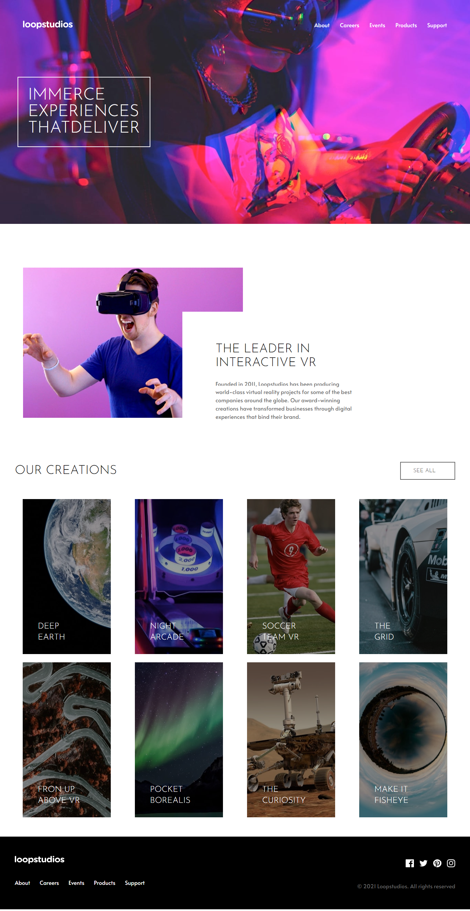

# Loopstudios landing Page

## Table of contents

- [Goals](#Goals)
- [Screenshot](#screenshot)
- [Links](#links)
- [Built with](#built-with)
- [Author](#author) 
- [Run Project](#run)

### Goals

Users should be able to:

- View the optimal layout for the site depending on their device's screen size
- See hover states for all interactive elements on the page

### Screenshot

### Links

live site url: [loopstudios](https://newt-loopstudios.netlify.app/)

### Biult with

- Semantic HTML5 markup
- CSS custom properties
- Flexbox
- CSS Grid
- Mobile-first workflow
- [TailwindCss](https://tailwindcss.com/)
- [React](https://reactjs.org/) - JS library
- [Vite](https://vitejs.dev) for faster biuld

## Author

- Frontend Mentor - [@newton-w](https://www.frontendmentor.io/profile/newton-w)
- LinkedIn - [@newton](https://www.linkedin.com/in/newton-warui)

## run
# Run the Project

    npm install
    npm run dev
